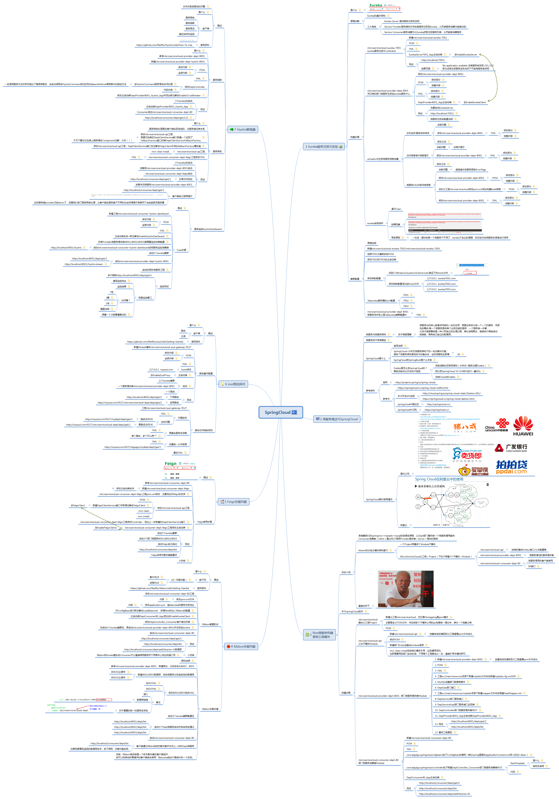

# SpringCloud

`概念：`微服务化的核心就是将传统的一站式应用，根据业务拆分成一个一个的服务，彻底去耦合，每个微服务提供单个业务功能的服务，一个服务做一件事，从技术角度看，就是一种小而独立的处理过程，类似进程概念，能够自行单独启动或销毁，拥有自己独立的数据库。

`重要概念`：

```text
1. 单一应用程序划分成一组小的服务
2. 每个服务都是一个自己独立的进程
```

-----

## SpringCloud和Dubbo

1. 通讯：
   * Dubbo使用的是RPC协议

      ```text
      RPC概念:
          首先，客户机调用进程发送一个有进程参数的调用信息到服务进程，然后等待应答信息。在服务器端，进程保持睡眠状态直到调用信息到达为止。当一个调用信息到达，服务器获得进程参数，计算结果，发送答复信息，然后等待下一个调用信息，最后，客户端调用进程接收答复信息，获得进程结果，然后调用执行继续进行。
      流程：
          1.调用客户端句柄；执行传送参数
          2.调用本地系统内核发送网络消息
          3.消息传送到远程主机
          4.服务器句柄得到消息并取得参数
          5.执行远程过程
          6.执行的过程将结果返回服务器句柄
          7.服务器句柄返回结果，调用远程系统内核
          8.消息传回本地主机
          9.客户句柄由内核接收消息
          10.客户接收句柄返回的数据
      ```

   * SpringCloud是基于HTTP的RESTful API

      ```
      什么是REST：
          REST 描述了一个架构样式的互联系统（如 Web 应用程序）。REST 约束条件作为一个整体应用时，将生成一个简单、可扩展、有效、安全、可靠的架构。由于它简便、轻量级以及通过 HTTP 直接传输数据的特性，RESTful Web 服务成为基于 SOAP 服务的一个最有前途的替代方案。用于 web 服务和动态 Web 应用程序的多层架构可以实现可重用性、简单性、可扩展性和组件可响应性的清晰分离。开发人员可以轻松使用 Ajax 和 RESTful Web 服务一起创建丰富的界面。
      
      RESTful的关键：
      	RESTful的关键是定义可表示流程元素/资源的对象。在REST中，每一个对象都是通过URL来表示的，对象用户负责将状态信息打包进每一条消息内，以便对象的处理总是无状态的。
      RESTful的第二大问题是组合管理及流程绑定。企业对正规的（基于SOAP）SOA最大的反对声之一便是，这种等级的发现和绑定灵活性不足以适应复杂性
      ```

      严格来说，这两种方式各有优劣。虽然从一定程度上来说，后者牺牲了服务调用的性能，但也避免了上面提到的原生RPC带来的问题。而且REST相比RPC更为灵活，服务提供方和调用方的依赖只依靠一纸契约，不存在代码级别的强依赖，这在强调快速演化的为服务环境下，显得更加合适。

2. 技术对比

   | 微服务条目       | Dubbo                                                        | SpringCloud                   |
   | ---------------- | ------------------------------------------------------------ | ----------------------------- |
   | 服务注册中心     | Zookeeper                                                    | Spring Cloud Netflix Eureka   |
   | 服务调用方式     | RPC                                                          | REST API                      |
   | 服务监控         | Dubbo-monitor                                                | SpringBoot Admin              |
   | 断路器           | 不完善                                                       | Spring Cloud  Netflix Hystrix |
   | 服务网关         | 无                                                           | Spring Cloud  Netflix Zuul    |
   | 分布式配置       | 无                                                           | Spring Cloud Config           |
   | 服务跟踪         | 无                                                           | Spring Cloud Sleuth           |
   | 消息总线         | 无                                                           | Spring Cloud Bus              |
   | 数据流           | 无                                                           | Spring Cloud Stream           |
   | 批量任务         | 无                                                           | Spring Cloud Task             |

   总结：

   <font color=#ff0000>品牌机与组装机的区别</font>

   很明显，SpringCloud的功能比Dubbo更加强大，涵盖面更广，而且作为Spring的拳头项目，他也能够与SpringFrameWork、SpringBoot、SpringData、SpringBatch等其他Spring项目完美融合，这些对于为服务而言是至关重要的。使用Dubbo构建的为服务框架就像组装电脑，各环节我们的选择自由度很高，但是最终结果很有可能因为一条内存质量不行就点不亮了，总是让人不怎么放心，但是如果你是一名高手，那这些都不是问题；而SpringCloud就像品牌机，在Spring Source的整合下，做了大量的兼容性测试，保证了机器有更高的稳定性，但是如果要在使用非原装组件外的东西，就需要对其基础有足够的了解。

   **主导 Dubbo 重启维护的刘军发言：**

   > <font color=#ff0000>目前 Dubbo 被拿来比较最多的就是 Spring Cloud ，您怎么看待二者的关系，业务上是否有所冲突？</font>
   >
   > ​	关于 Dubbo 和 Spring Cloud 间的关系，我们在开源中国年终盛典的 Dubbo 分享中也作了简单阐述。
   >
   > ​	首先要明确的一点是 Dubbo 和 Spring Cloud 并不是完全的竞争关系，两者所解决的问题域并不一样：Dubbo 的定位始终是一款 RPC 框架，而 Spring Cloud 的目标是微服务架构下的一站式解决方案。
   >
   > ​	如果非要比较的话，我觉得 Dubbo 可以类比到 Netflix OSS 技术栈，而 Spring Cloud 集成了 Netflix  OSS 作为分布式服务治理解决方案，但除此之外 Spring Cloud 还提供了包括  config、stream、security、sleuth 等等分布式问题解决方案。
   >
   > ​	当前由于 RPC 协议、注册中心元数据不匹配等问题，在面临微服务基础框架选型时 Dubbo 与 Spring Cloud 是只能二选一，这也是为什么大家总是拿 Dubbo 和 Spring Cloud 做对比的原因之一。
   >
   > Dubbo 之后会积极寻求适配到 Spring Cloud 生态，比如作为 Spring Cloud 的二进制通信方案来发挥 Dubbo 的性能优势，或者 Dubbo 通过模块化以及对 http 的支持适配到 Spring Cloud 。

-------

## 特点

`All In One单机系统`

可以看做eclipse里面只有一个大的工程

商品/订单/交易/库存...


`分布式系统`

各个模块/服务，各自独立出来，分灶吃饭

各自微小的一个进程，让专业的人专业的模块，来做专业的事

独立部署

* 拆分
  - 
  - 

* 各自独立进程

  

* 拥有自己独立的数据库

  

---

## 微服务和微服务架构

`微服务：`

强调的服务的大小，它关注的是某一个点，是具体解决某一个问题/提供落地对应服务的一个服务应用，狭义的看，可以看做eclipse里面一个个微服务工程或者module。

`微服务架构`：

微服务架构是一种架构模式，它提倡将单一应用程序划分成一组小的服务，服务之间互相协调，互相配置，为用户提供最终价值，每个服务运行在其独立的进程中，服务与服务间采用轻量级的通信机制户型协作。

---

微服务优缺点：

`优点`：
   * 每个服务足够内聚，足够小，代码容易理解这样能够聚焦一个指定的业务功能或业务需求。
   * 开发简单，开发效率提高，一个服务可能就是专一的只干一件事情。
   * 微服务是松耦合的，是有功能意义的服务，无论是在开发阶段或部署阶段都是独立的。
   * 微服务能够被小团队单独开发。
   * 微服务能使用不同的语言开发。
   * 易于和第三方集成，微服务允许容易且灵活的方式集成自动部署，通过持续集成工具，如Jenkins、Hudson、bamboo。
   * 微服务易于被一个开发人员理解、修改和维护，这样小团队能够更关注自己的工作成果。无需通过合作才能体现价值。
   * 微服务允许你利用融合最新技术。
   * <font color=#FF0000>微服务只是业务逻辑的代码，不会和HTML/CSS或其他界面组件混合。</font>
   * <font color=#FF0000>每个微服务都有自己的存储能力，可以有自己的数据库，也可以统一数据库。</font>

`缺点`：
   * 开发人员要处理分布式系统的复杂性
   * 多服务运维难度，随着服务的增加，运维的压力也在增大
   * 系统部署依赖
   * 服务间通讯成本
   * 数据一致性
   * 系统集成测试
   * 性能监控

---

## 微服务技术栈

| 微服务条目     | 落地技术 | 备注 |
| -------------- | -------- | ---- |
| 服务开发       | springboot、spring、springmvc |      |
| 服务配置与管理 | Netflix公司的Archaius、阿里的Diamond |      |
| 服务注册于发现 | Eureka、Consul、Zookeeper |      |
| 服务调用       | Rest、RPC、gRPC |      |
| 服务熔断器     | Hystrix、Envoy |      |
|负载均衡| Ribbon、Nginx | |
|服务接口调用（客户端调用服务的简化工具）|Feign||
|消息队列|Kafka、RabbitMQ、ActiveMQ||
|服务配置中心管理|SpringCloudConfig、Chef||
|服务路由（API网关）|Zuul||
|服务监控|Zabbix、Nagios、Metrics、Spectator||
|全链路追踪|Zipkin、Brave、Dapper||
|服务部署|Docker、OpenStack、Kubernetes||
|数据流操作开发包|SpringCloud Stream（封装Redis，Rabbit，Kafka等发送消息的接收）||
|事件消息总栈|SpringCloud Bus||


# 学习路线思维导图

